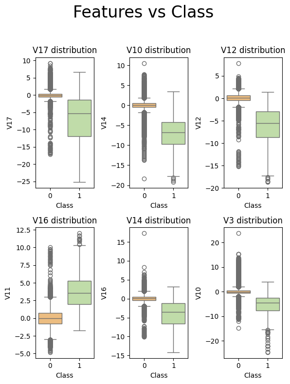

# Introdución
---

#### El fraude financiero representa un desafío significativo para bancos e instituciones financieras en todo el mundo, ya que puede resultar en pérdidas financieras sustanciales y dañar la reputación de una empresa. En los últimos años, el Aprendizaje Automático se ha convertido en una herramienta valiosa para mejorar la detección de fraudes financieros. En este proyecto, asumiré el rol de un científico de datos y desarrollaré un modelo capaz de detectar fraudes con un alto nivel de precisión.

---

# Dataset Seleccionado
---

Para llevar a cabo mi siguiente proyecto, seleccioné el conjunto de datos público de [Worldline and the Machine Learning Group](http://mlg.ulb.ac.be) . La razón principal para elegir este conjunto de datos en lugar de otros radica en la calidad de la información proporcionada. A diferencia de algunos conjuntos de datos sintéticos, este dataset contiene datos del mundo real, lo que lo hace más representativo y valioso para la investigación y experimentación en aprendizaje automático.

Además, uno de los aspectos más destacados de este conjunto de datos es el significativo desequilibrio entre las etiquetas positivas y negativas. Este desequilibrio plantea un desafío interesante, ya que refleja situaciones comunes en problemas del mundo real, como la detección de fraudes o enfermedades raras, donde los casos positivos son una minoría. La exploración y resolución de problemas en conjuntos de datos altamente desbalanceados son de gran importancia, ya que las técnicas adecuadas pueden ayudar a mejorar la precisión y el rendimiento de los modelos.

> *The dataset contains transactions made by credit cards in September 2013 by European cardholders.*
> 
> *This dataset presents transactions that occurred in two days, where we have 492 frauds out of 284,807 transactions. The dataset is highly unbalanced, the positive class (frauds) account for 0.172% of all transactions.*
> 
> *It contains only numerical input variables which are the result of a PCA transformation. Unfortunately, due to confidentiality issues, we cannot provide the original features and more background information about the data. Features V1, V2, … V28 are the principal components obtained with PCA, the only features which have not been transformed with PCA are 'Time' and 'Amount'. Feature 'Time' contains the seconds elapsed between each transaction and the first transaction in the dataset. The feature 'Amount' is the transaction Amount, this feature can be used for example-dependant cost-sensitive learning. Feature 'Class' is the response variable and it takes value 1 in case of fraud and 0 otherwise.*
> 
> *Given the class imbalance ratio, we recommend measuring the accuracy using the Area Under the Precision-Recall Curve (AUPRC). Confusion matrix accuracy is not meaningful for unbalanced classification.*

# Objetivos
---

- Evaluar el rendimiento de diversos algoritmos y realizar ajustes de hiperparámetros.

- Implementar técnicas para abordar el desequilibrio en el dataset.

- Alcanzar altos niveles de **AUC-ROC** ya que  es crucial utilizarlas en un dataset altamente desbalanceado. Las métricas "tradicionales" pueden dar resultados contraintuitivos. Por ejemplo, si clasificáramos todos los registros como "no fraudulentos", obtendríamos un Accuracy Score de más del 99%. La métrica AUC-ROC se convierte en una alternativa sólida en esta circunstancia.

- **Seleccionar los modelos más efectivos y crear un conjunto de modelos para optimizar los resultados.**

- LLegar a una conclusion de la rentabilidad del ensamblado de modelos.

###### [Articulo sobre meta clasificadores en modelos de prevencion de fraude financiero](https://www.sciencedirect.com/science/article/abs/pii/S1544612322001866).
---

# Tecnologías utilizadas

- ### Selección de Características::
    - Dado que el conjunto de datos ya ha sido preprocesado mediante un algoritmo de PCA, llevé a cabo la selección de características basándome en la importancia de las características del algoritmo **Random Forest Classifier.**

- ### Re-Balanceo del Dataset:
    - Realicé pruebas con tres técnicas diferentes: **UnderSampling, OverSampling y SMOTE** a través de la biblioteca imblearn. De las tres, la que proporcionó mejores resultados fue SMOTE, que genera datos sintéticos para la clase minoritaria al combinar instancias existentes con sus vecinos cercanos, abordando así el desequilibrio de clases en conjuntos de datos

- ### Selección de Algoritmos:
    - Inicié con 7 algoritmos diferentes:
        - **AdaBoost** (Adaptive Boosting): un algoritmo de aprendizaje automático que mejora el rendimiento de modelos de clasificación al dar más importancia a las instancias clasificadas incorrectamente en cada iteración, permitiendo que modelos débiles se combinen en un modelo fuerte para tomar decisiones más precisas.

        - **RUSBoost**: un algoritmo de aprendizaje automático que combina Random Under-Sampling (RUS) con AdaBoost para abordar el desequilibrio de clases en conjuntos de datos. RUS se utiliza para reducir la cantidad de ejemplos de la clase mayoritaria, y luego se aplica AdaBoost a los datos equilibrados para mejorar la clasificación.

        - **Random Forest**: un algoritmo de aprendizaje automático que construye un conjunto de árboles de decisión y utiliza su combinación para realizar predicciones más precisas y robustas.

        - **Extra Trees**: se toman múltiples muestras aleatorias de las características y se eligen los umbrales de manera más aleatoria en cada nodo del árbol de decisión, lo que lo hace aún más robusto y menos propenso al sobreajuste en comparación con Random Forest.

        - **KNN** (K-Nearest Neighbors): un algoritmo de aprendizaje supervisado que clasifica un punto de datos según la mayoría de sus k vecinos más cercanos en un espacio multidimensional.

        - **SVM** (Support Vector Machine): un algoritmo de aprendizaje automático que se utiliza para clasificar datos o realizar regresión. Busca encontrar un hiperplano de separación óptimo que maximice la distancia entre las clases en un espacio multidimensional.

        - **XGBOOST**: un algoritmo de aprendizaje automático que utiliza árboles de decisión y técnicas de aumento para mejorar la precisión de la clasificación y la regresión.

        - Para entrenar todos los modelos se utilizó **StratifiedKFold** para prevenir al maximo el riesgo de overfitting. Tambien se realizó el tuning de los modelos mediante **GridSearchCV** y **RandomizedSearchCV**.

        Después de varias pruebas, se descartaron SVM, AdaBoost y RUSBoost.

- ### Model Ensambling

    - Realicé pruebas para evaluar la capacidad de modelos ensamblados. En estas pruebas se utilizaron 3 distintos tipos de ensambles: **Stackin, Soft Voting y Hard Voting**. Finalmente decidí por comparar resultados con solo dos de ellos, Stacking y Soft Voting.

    ##### [Articulo sobre stacking](https://machinelearningmastery.com/stacking-ensemble-machine-learning-with-python/)
    ##### [Articuo sobre Voting](https://ilyasbinsalih.medium.com/what-is-hard-and-soft-voting-in-machine-learning-2652676b6a32)
---

# Contenidos:

- ### Notebooks
    - **EDA+Feature_selection.ipynb:** Donde se realizó el analisis exploratorio de datos. Tambien se realizo la seleccion de caracteristicas

    - **Model_Ensamblig.ipynb:** Donde se realizo el ensamblado de modelos. Se probaron las tres tecnicas de ensamblado antes mencionadas

      

- ### Carpetas
    - **tuning:** Contiene los notebooks donde se entrenaron y optimizaron los siete modelos probados para el proyecto

    - **Models:** Contiene los siete modelos ya entrenados en formato *.plk*.

- ### CSV

    - **fraud_reduced.csv:** Dataset reducido con las de caracteristicas seleccionadas y la etiqueta de salida.

    El conjunto de datos original se puede descargar del siguiente [link](https://www.kaggle.com/datasets/mlg-ulb/creditcardfraud)

# EDA.

- **Features**: 
    - 30 Variables de entrada
        - *Time*: Tiempo medido en segundos, comienza a contar desde el inicio de la recopilacion de datos.
        - *Amount*: Unidades transaccionadas
        - *V1 - V28*: Variables de entrada codificadas a por PCA. Se utilizarán solo estas para el modelado.

- **Label**
    - Columna que refiere a la caracteristica de salida. 0 indica transaccion normal, 1 indica transaccion fraudulenta.
    - Hubieron 284.315 transacciones normales (99.828%), 492 transacciones fraudulentas (0.172%).
    - Hay un desbalance extremo entre etiquetas. Posibles alternativas : RandomUnderSampler, RandomOverSampler o SMOTE

    

- El Conjunto de datos **no presenta valores nulos.**

- **Se observan gran cantidad valores atipicos**, al tratarse de tantos y tener tan pocas etiquetas positivas decido mantenerlos para evitar la perdida de datos importantes para el modelo.

- **El conjuto de datos no presenta valores duplicados**.

# Comparación del modelo.

- ## Modelos Base Utilizados

- ## Soft Voting Classifier

- ## Stacking Models

# Conclusiones

La imposibilidad de acceder a las características de entrada antes de su codificación representó un desafío desde una perspectiva analítica. Sin embargo, este obstáculo me impulsó a buscar soluciones desde una perspectiva computacional para abordar eficazmente el problema.

El objetivo personal que me planteé al iniciar este proyecto fue profundizar en los diversos métodos disponibles para abordar un proyecto de clasificación binaria en un conjunto de datos altamente desbalanceado. Realicé pruebas utilizando los tres métodos previamente seleccionados, y los resultados más prometedores se obtuvieron al aplicar tanto UnderSampling como SMOTE *(Synthetic Minority Over-sampling Technique)*. Sin embargo, es importante destacar que no busqué equilibrar las etiquetas al 50/50, ya que introducir información artificial en exceso al conjunto de datos tuvo un impacto negativo en la capacidad de predicción.

El concepto de ensamble de modelos se presenta como una alternativa atractiva para abordar este tipo de casos. Al combinar múltiples modelos de aprendizaje automático, se busca aprovechar la diversidad de enfoques y fortalezas de cada modelo individual, lo que puede llevar a una mejora significativa en la precisión de las predicciones. Sin embargo, a lo largo de mi proyecto, observé que esta estrategia parece requerir un conjunto de datos más extenso para su funcionamiento óptimo. 

En conjuntos de datos altamente desbalanceados, donde la clase minoritaria tiene una presencia limitada, es más difícil para estos ensambles generalizar y encontrar patrones significativos que ayuden a la clasificación de la clase minoritaria.
La falta de ejemplos de la clase minoritaria puede llevar a un desequilibrio en el aprendizaje de los modelos del ensamble, lo que a su vez puede resultar en un sesgo hacia la clase mayoritaria en las predicciones. Además, en casos de datos insuficientes, es más probable que el ensamble caiga en sobreajuste, donde se ajusta demasiado a los datos de entrenamiento, lo que disminuye su capacidad para generalizar en datos no vistos.

# TODO

- Realizar Feature Ingeniering utilizando Isolation Forest o DBSCAN añadiendo una columna de "anomalia" y verificar con los mismos algoritmos si el AUC_ROC mejora.

